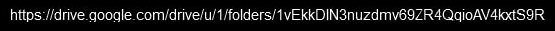

# ITCTF-writeups
Write-ups for the CTF @lockness-Ko, @MailSRocks, and I made for our cybersecurity class.

## Easy1 ##

## Easy2 ##

## Med1 ##

## Hard1 ##

## Hard2 ##
Starting, the challenge includes a link to a file called “`backrooms.mp3`”. After viewing the video you may notice that for a 10th of a second, a Google drive link flashes up on screen.

</a>

</a>

After entering this link into the address bar, we will be greeted by two images; “`ssssssssssssssssssssssssssssss.png`” and “`treat j as i.png`”.

